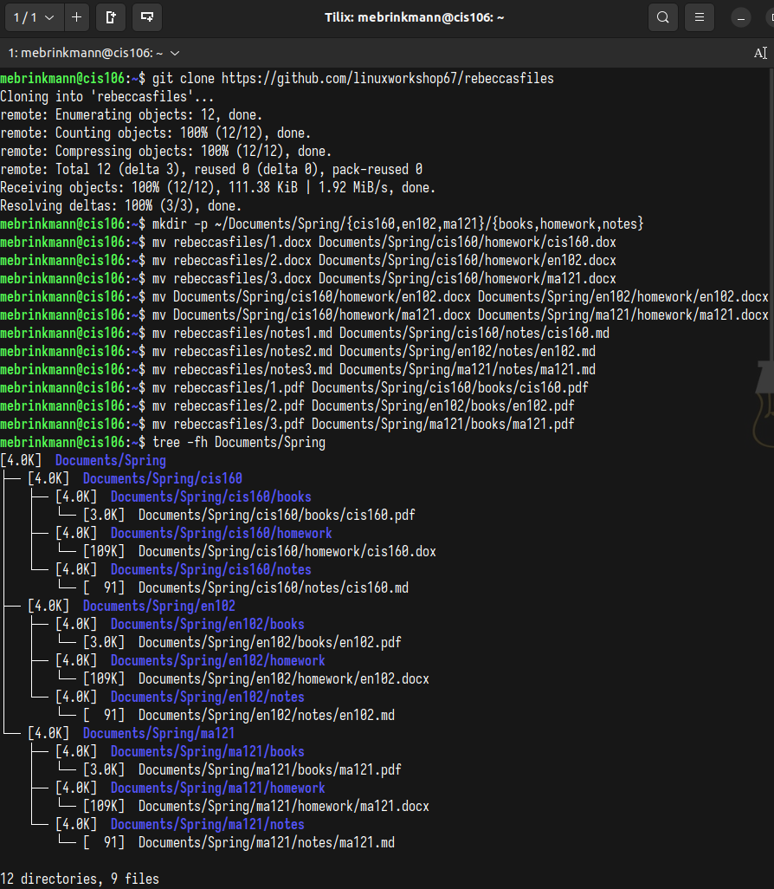
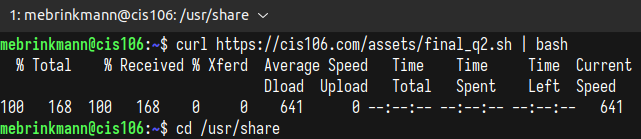
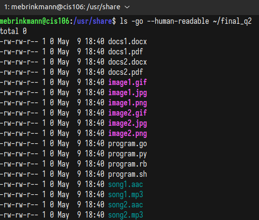
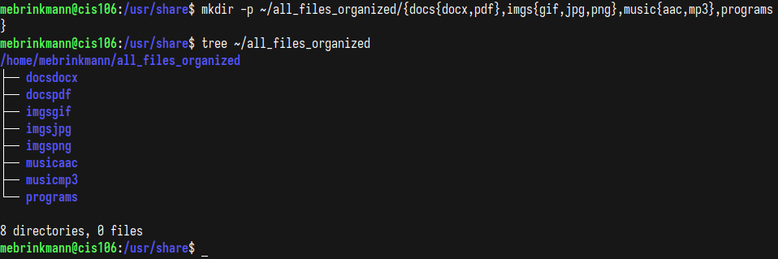

# Final Exam Submission

## Question 1
 

## Question 2
 
 
 

## Question 3
Did Not Complete  

**Note:** I am not great with timed assignments and tests and that is something I know that I need to work on. I am turning the exam in with this much complete because I believe that my grades otherwise give me that luxury and because I would rather not stress and burn myself out on one assignment that is giving me a hard time. Thank you for a great semester and have a great summer!