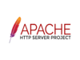

# Deliverable 1

## Basic Terminology

### What is a web server? Hardware and software side
* On the hardware side, it is a computer that stores web server software and a website's component files, and connects to the INternet and supports physical data interchange with other devices connected to the web.
* On the software side, it includes several parts that control user access to hosted files.

### What are some different web server applications?
| Application Name   | license         | Project's Website                               |
| ------------------ | --------------- | ----------------------------------------------- |
| Apache HTTP Server | Apache-2.0      | [Apache HTTP Server](https://httpd.apache.org/) |
| Nginx              | FreeBSD license | [Nginx](https://www.nginx.com/)                 |
| Lighttpd           | BSD-3-Clause    | [Lighttpd](https://www.lighttpd.net/)           |

**Apache HTTP Server**
 
The Apache HTTP Server is a free and open-source cross-platform web server software, released under the terms of Apache License 2.0.

**Nginx**
 
Nginx is a web server that can also be used as a reverse proxy, load balancer, mail proxy and HTTP cache. The software was created by Igor Sysoev and publicly released in 2004. Nginx is free and open-source software, released under the terms of the 2-clause BSD license.

**Lighttpd**
 
Lighttpd is an open-source web server optimized for speed-critical environments while remaining standards-compliant, secure and flexible.

### What is virtualization?
Defined as creating virtual versions of something, is often used to let multiple OSs run on one physical machine at the same time, and allows administrators to divide the hardware and create multiple computers inside a single physical computer.

### What is virtualbox?
 
A powerful x86 AMD64/INTEL64 virtualization product for enterprise as well as home use. The only professional solution that is freely available as Open Source Software under the terms of the GNU General Public License (GPL) version 3.

### What is a virtual machine?
A virtual environment that functions as a virtual computer system with its own CPU, memory, network interface, and storage, created on a physical hardware system(located off- or on-premises).

### What is Ubuntu Server?
 
A part of the larger set of Ubuntu products and operating system developed by Canonical Ltd. Ubuntu server is a specific addition that differs a little bit from Ubuntu desktop, in order to facilitate installation on servers.

### What is a firewall?
In computing, a firewall is a network security system that monitors and controls incoming and outgoing network traffic based on predetermined security rules. A firewall typically establishes a barrier between a trusted network and an untrusted network, such as the Internet.

### What is SSH?
A network protocol that gives users, particularly system administrators, a secure way to access a computer over an unsecured network.

## Other Concepts
* `sudo systemctl status apache2`
    * 'We use systemctl status command under systemd to view the status of the given service on Linux operating systems.' this command would be used to see the status of the apache2 service on the system.
