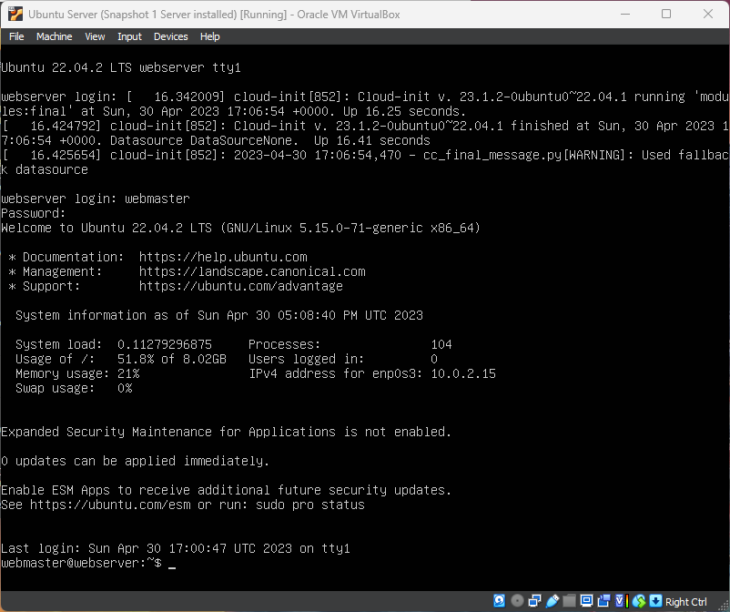
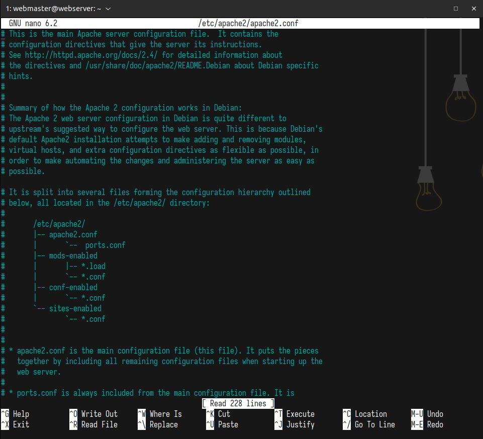

# Deliverable 2

## Part 1

This is the virtual machine hardware configuration. 

## Part 2

This is the login screen to the server right after signing in. 

## Part 3

This is a screenshot of the server connecting to my Ubuntu Desktop via ssh. 

## Part 4
### Part 4.1

This is the status of 'apache2'. 

### Part 4.2

This is the status of 'sshd'. 

### Part 4.3

This is the status of 'ufw'. 

## Part 5
### Part 5.1

This is a screenshot of Apache log file: access.log. 

### Part 5.2

This is a screenshot of Apache log file: error.log. 

### Part 5.3

This is a screenshot of SSH log file: auth.log. 

## Part 6
### Part 6.1

This is a screenshot of sites-available config file. 

### Part 6.2

This is a screenshot of apache 2 config file. 

## Part 7

This is a screenshot of the ip address of my server and the website being accessed all from the Ubuntu Desktop Virtual machine. 