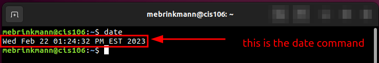
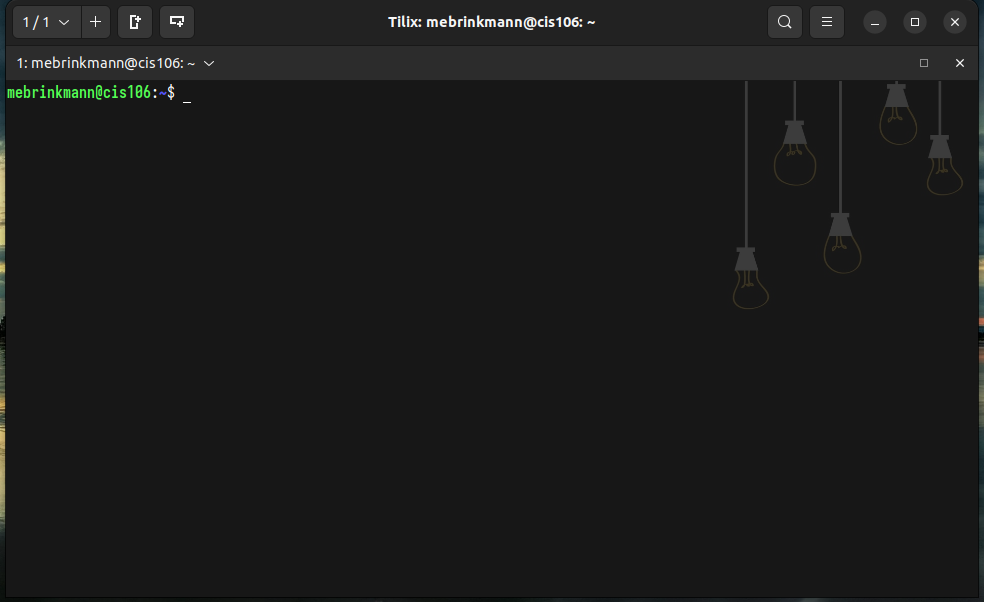
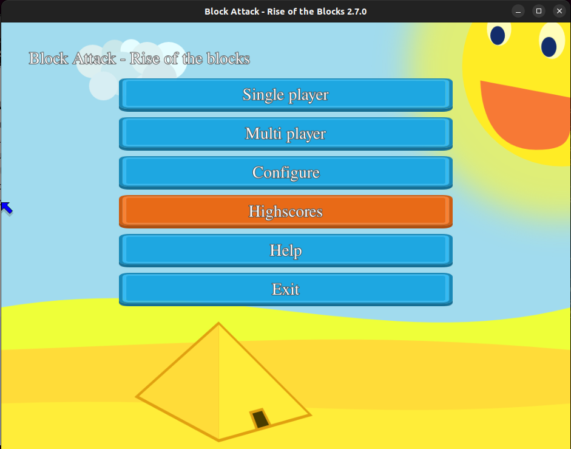
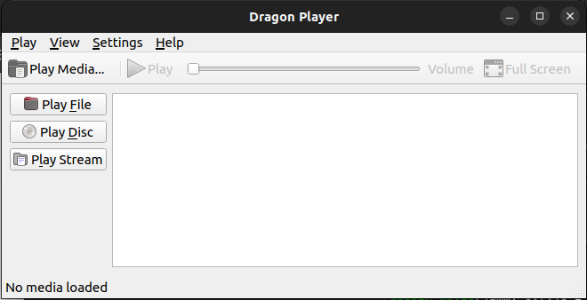
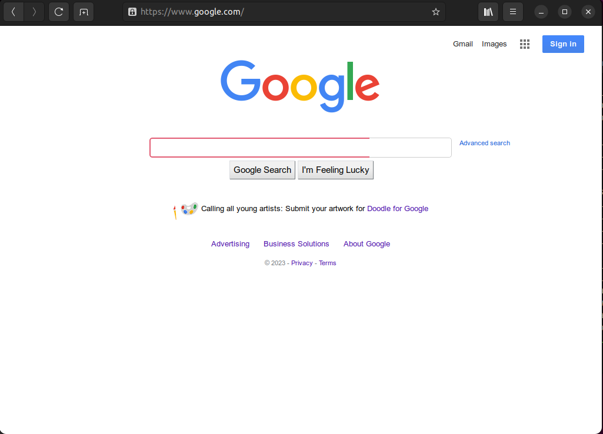
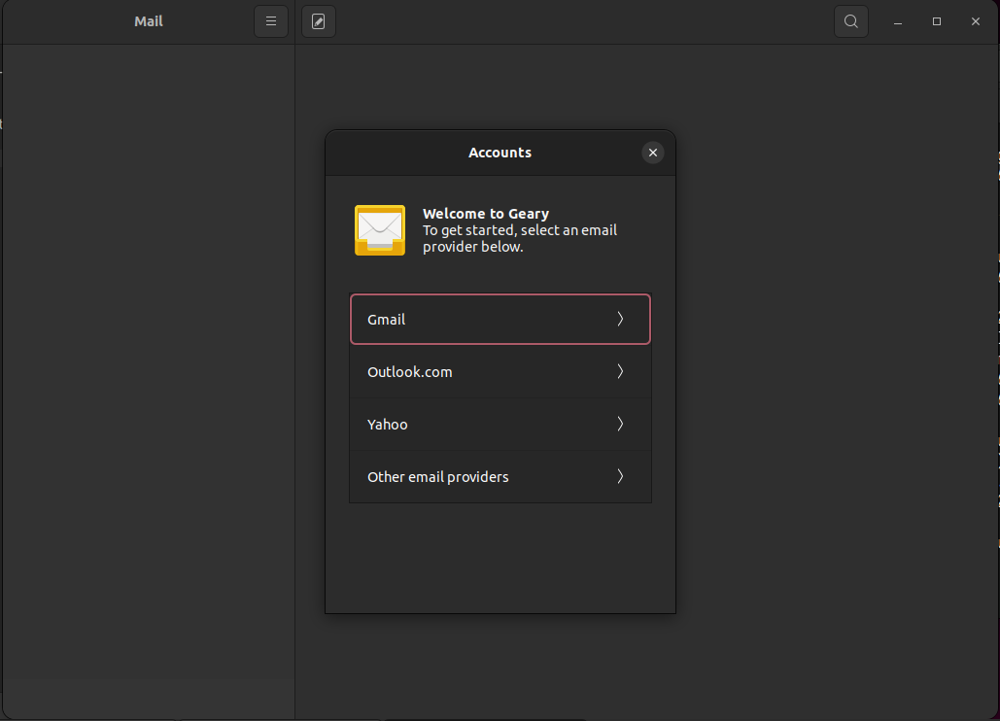
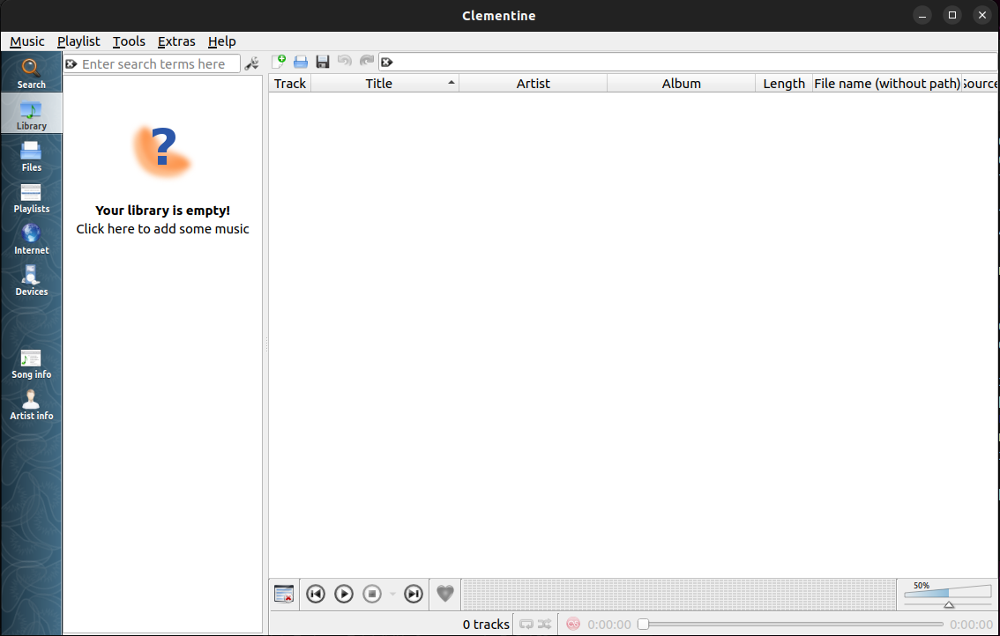

'''
name: Meghan Brinkmann
course: CIS-106-ME1
semester: spring 23
'''

# Lab 3 Submission

## Question 1

## Question 2

## Question 3
| Program purpose     | Package Name     | Version |
| ------------------- | ---------------- | ------- |
| Play a tetris game  | blockattack      | 2.7.0   |
| Play a video file   | dragonplayer     | 21.12.3 |
| Browse the internet | epiphany-browser | 42.4    |
| Read your email     | geary            | 40.0    |
| Play music          | clementine       | 1.4.0   |

## Question 4
| command | what it does                                                   |
| ------- | -------------------------------------------------------------- |
| echo    | display a line of text                                         |
| fortune | print a random, hopefully interesting, adage                   |
| cowsay  | configurable speaking/thinking cow (and a bit more)            |
| lolcat  | rainbow coloring effect for text console display               |
| figlet  | display large characters made up of ordinary screen characters |
| toilet  | display large colourful characters                             |
| rig     | Random Identity Generator                                      |
