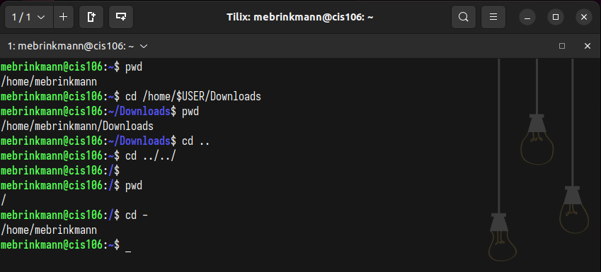
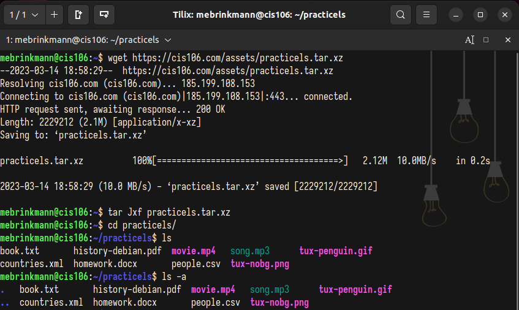
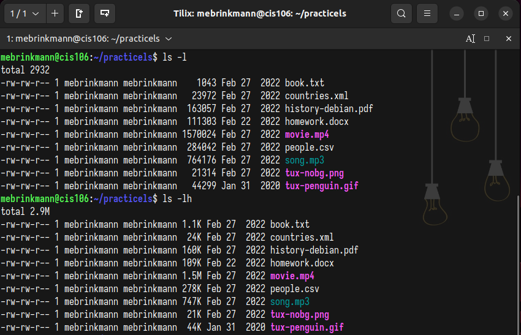
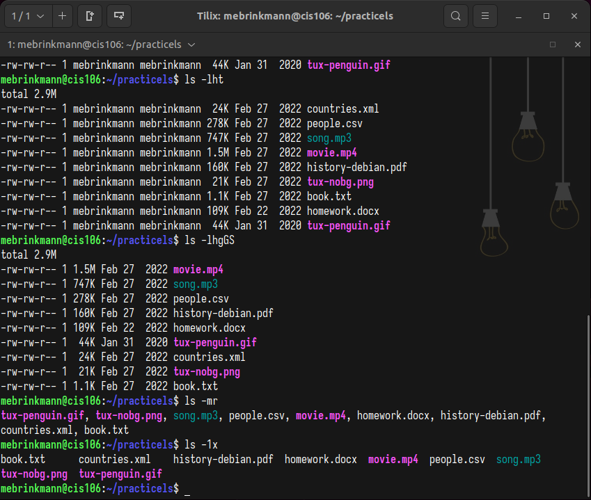
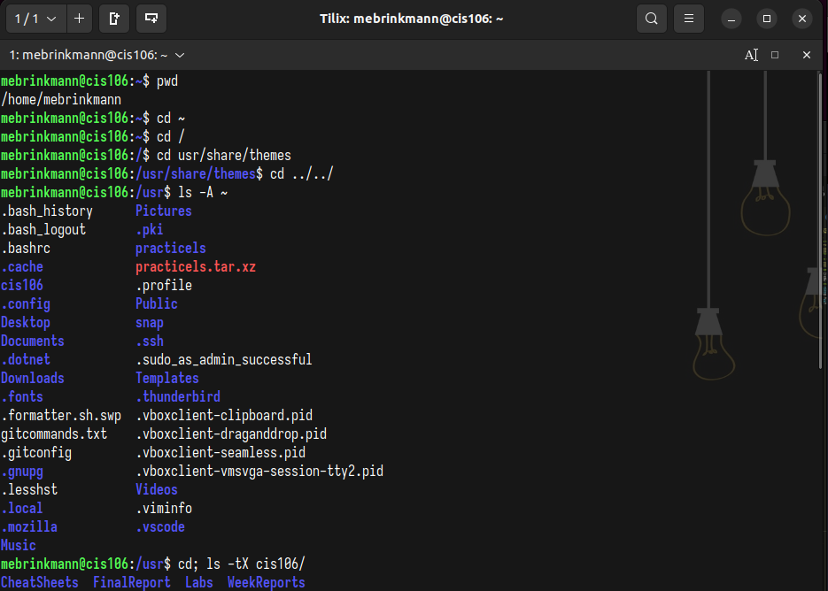
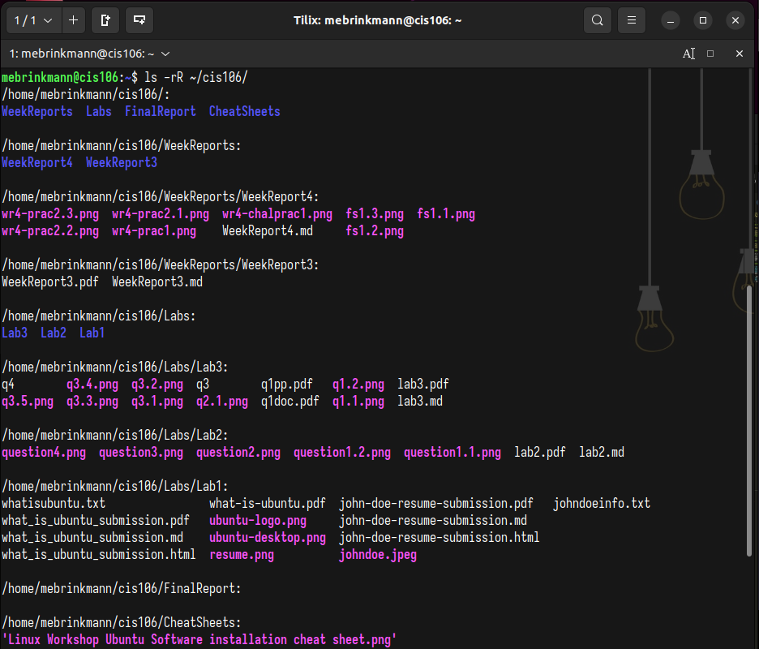
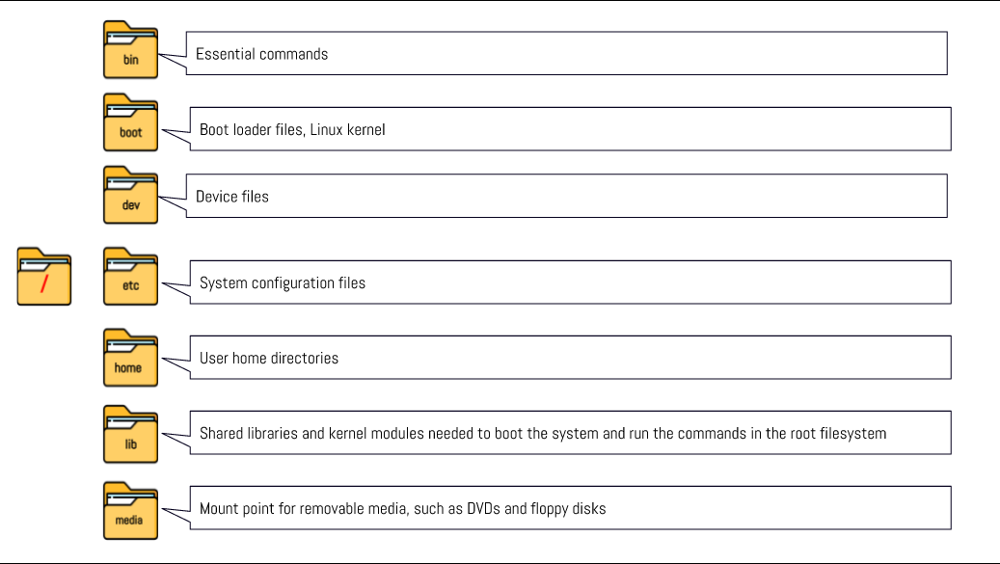
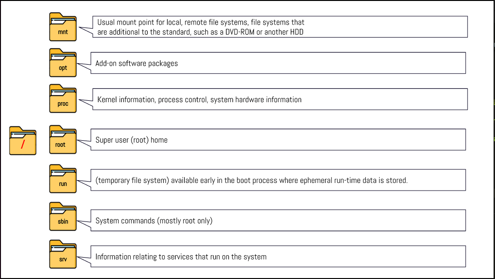
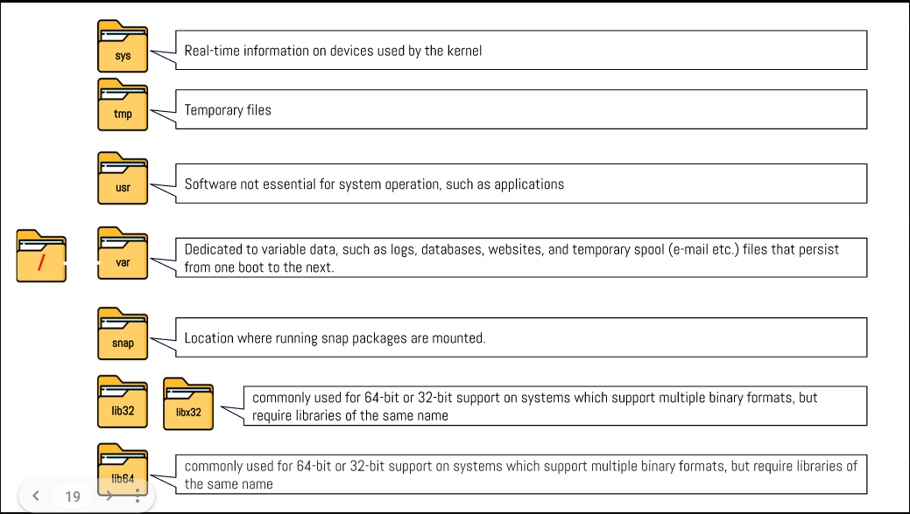

# Week Report 4

## Practice from the Presentation The Linux File System
### Practice 1
 
### Practice 2
 
 
 
### Challenge Practice
 
 
 

## The Linux File System Directories and Their Purpose

 
 
 

## All The Commands for Navigating the Filesystem

| Command | What it does                          | Syntax | Example                        |
| ------- | ------------------------------------- | ------ | ------------------------------ |
| pwd     | prints current directory              | pwd    | `pwd`                          |
| cd      | changes the current working directory | cd     | `cd` + `/home/$USER/Documents` |
| ls      | lists files inside a given directory  | ls     | `ls` + `-a` + `~/Music`        |

## Basic Terminology

* **File system:** the way files are stored and organized
* **Current directory:** the directory where you are at the moment
* **parent directory:** the directory that precedes your current directory
* **the difference between your home directory and the home directory:** YOUR home directory is only accessible from your user profile. THE home directory is accessible by the admin of the system.
* **pathname:** indicates the location of the file in the file system
* **relative path:** the location of a file starting at the root of the file system
* **absolute path:** the location of a file starting from the current directory or a directory that is located inside the current directory.
* 