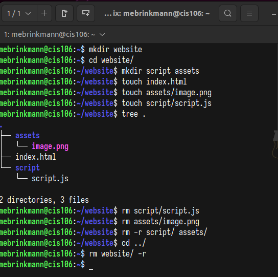

# Week Report 5

## Answer to Questions:

* **What are Command Options?**
Command options modify or enhance their behavior.
* **What are Command Arguments?**
Command arguments are the items which the command acts on.
* **Which command is used for creating directories? Provide at least 3 examples.**
The command is mkdir.
  * Example 1:
    * Create a directory: `mkdir magician`
  * Example 2:
    * Create multiple directories: `mkdir movies ~/Downloads/videos ~/Documents/resume`
  * Example 3:
    * Create a directory with a parent directory at the same time: `mkdir -p images/birthdaytrip`
* **What does the touch command do? Provide at least 3 examples.**
The touch command creates files.
  * Example 1:
    * Create a single file: `touch image1.png`
  * Example 2:
    * Create a file using absolute path: `touch ~/Pictures/image2.png`
  * Example 3:
    * Create a file with a space in its name: `touch "birthday cake.jpeg"`
* **How do you remove a file? Provide an example.**
The rm command removes files.
  * `rm docs/sample2.doc`
* **How do you remove a directory and can you remove non-empty directories in Linux? Provide an example.**
To remove a directory use rm with the -r command
  * To remove empty directories, use `rmdir`
  * To remove non-empty directories, use `rm -r (directory name)`
* **Explain the mv and cp command. Provide at least 2 examples of each.**
The mv command moves and renames directories
  * Example 1:
    * To move from one directory to another: `mv Downloads/homework.pdf Documents/`
  * Example 2:
    * To move and rename a file: `mv Downloads/homework.docx Documents/new_homework.docx`
The cp command copies files and directories from a source to a destination
  * Example 1:
    * To copy a file: `cp Downloads/wallpaper/background.png Pictures/`
  * Example 2:
    * To copy the content of a directory to another: `cp Downloads/wallpaper/* ~/Pictures/`
## Practice 1
 
## Practice 2
 
## Practice 3
 
## Practice 4
 
