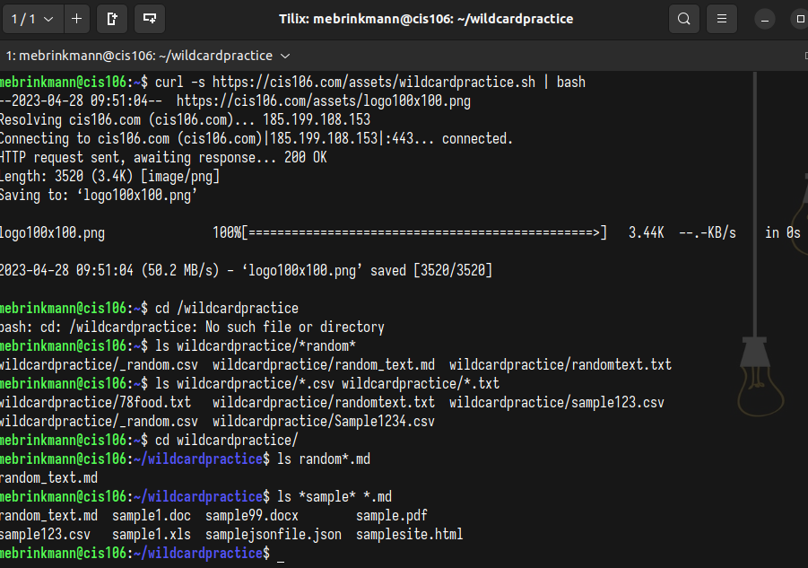

# Week Report 6

## Wildcards 

### * Wildcard
The * wild card matches from 0 to any number of characters
* Examples:
  * List all the text file in a directory
    * `ls *.txt`
  * List all the files that start with the word file
    * `ls file*`
  * Copy all the mp4 files
    * `cp Downloads/*.mp4 ~/Videos/Movies/`

### ? Wildcard
The ? wildcard matches a single character
* Examples
  * list all the files that have 3 characters and are followed by the word file in the name
    * `ls ???File*`
  * list all hidden files
    * `ls ../.??*`
  * list all the files with a four letter file extension
    * `ls *.????`

### [] Wildcard
The [] wildcard matches a single character in a range. Uses the ! to reverse the match.
* Examples:
  * to match all files whose name has at least one number
    * `ls *[0-9]*`
  * to match all files whose name begins with a letter from a-p
    * `ls [a-p]*`
  * to match all files that have a vowel after letter m
    * `ls m[aeiou]*`

### Brace Expansion
The brace expansion, {}, is not a wildcard, but another feature of bash that allows you to generate arbitrary strings to use with commands.
* Examples:
  * to create a whole directory structure in a single command
    * `mkdir -p music/{punk,rock}/{mp3files,videos,oggfiles}/new{1..3}`
  * to create N number of files
    * `touch image{1..5}.jpg`
  * to remove multiple files in a single directory
    * `rm -r {dir1,di2,dir3,file.txt}`

## Practice

### Practice 5
 

### Practice 6
 

### Practice 7
 
